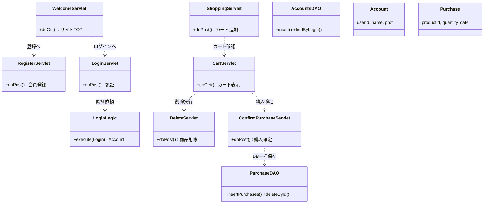
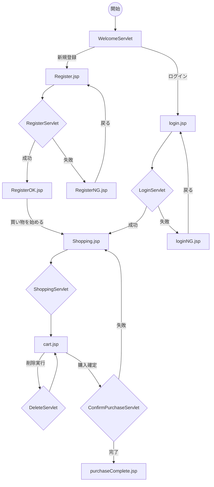

## クラス図

```mermaid
classDiagram
    %% Controller (Servlet) - ユーザーの入り口
    class WelcomeServlet { +doGet() サイトTOP }
    class RegisterServlet { +doPost() 会員登録 }
    class LoginServlet { +doPost() 認証 }
    class ShoppingServlet { +doPost() カート追加 }
    class CartServlet { +doGet() カート表示 }
    class DeleteServlet { +doPost() 商品削除 }
    class ConfirmPurchaseServlet { +doPost() 購入確定 }

    %% Service (Logic) - 判定・処理
    class LoginLogic { +execute(Login) Account }

    %% Repository (DAO) - DB操作
    class AccountsDAO { +insert() +findByLogin() }
    class PurchaseDAO { +insertPurchases() +deleteById() }

    %% Entity (Model) - データの持ち運び
    class Account { userId, name, prof }
    class Purchase { productId, quantity, date }

    %% 遷移と依存の関係
    WelcomeServlet ..> RegisterServlet : 登録へ
    WelcomeServlet ..> LoginServlet : ログインへ
    LoginServlet ..> LoginLogic : 認証依頼
    ShoppingServlet ..> CartServlet : カート確認
    CartServlet ..> DeleteServlet : 削除実行
    CartServlet ..> ConfirmPurchaseServlet : 購入確定
    ConfirmPurchaseServlet ..> PurchaseDAO : DB一括保存
```

## 2. 画面遷移図

```mermaid
graph TD
    Start((開始)) --> Welcome[WelcomeServlet]
    Welcome -->|新規登録| Register[Register.jsp]
    Welcome -->|ログイン| LoginView[login.jsp]
    
    Register --> RegServlet{RegisterServlet}
    RegServlet -->|成功| RegOK[RegisterOK.jsp]
    RegServlet -->|失敗| RegNG[RegisterNG.jsp]
    RegNG -->|戻る| Register
    RegOK -->|買い物を始める| Shopping[Shopping.jsp]

    LoginView --> LoginServlet{LoginServlet}
    LoginServlet -->|成功| Shopping
    LoginServlet -->|失敗| LoginNG[loginNG.jsp]
    LoginNG -->|戻る| LoginView

    Shopping --> ShopServlet{ShoppingServlet}
    ShopServlet --> Cart[cart.jsp]
    
    Cart -->|削除実行| DelServlet{DeleteServlet}
    DelServlet --> Cart
    
    Cart -->|購入確定| ConfirmServlet{ConfirmPurchaseServlet}
    ConfirmServlet -->|完了| Done[purchaseComplete.jsp]
    ConfirmServlet -->|失敗| Shopping
```
