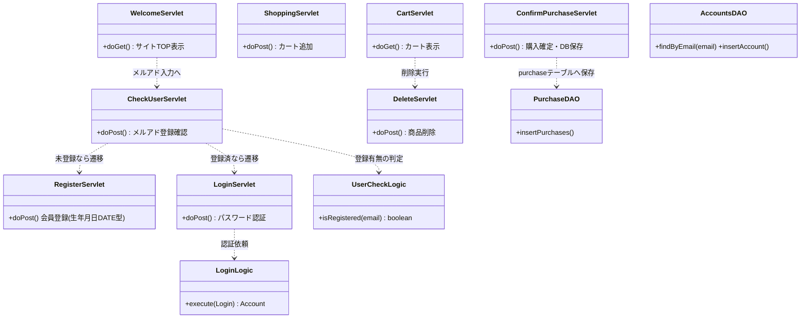
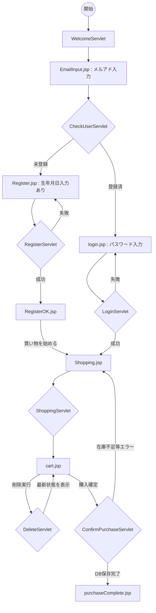

## クラス図

```mermaid
classDiagram
    %% Controller (Servlet)
    class WelcomeServlet { +doGet() サイトTOP表示 }
    class CheckUserServlet { +doPost() メルアド登録確認 }
    class RegisterServlet { +doPost() 会員登録(生年月日DATE型) }
    class LoginServlet { +doPost() パスワード認証 }
    class ShoppingServlet { +doPost() カート追加 }
    class CartServlet { +doGet() カート表示 }
    class DeleteServlet { +doPost() 商品削除 }
    class ConfirmPurchaseServlet { +doPost() 購入確定・DB保存 }

    %% Service (Logic)
    class UserCheckLogic { +isRegistered(email) boolean }
    class LoginLogic { +execute(Login) Account }

    %% Repository (DAO)
    class AccountsDAO { +findByEmail(email) +insertAccount() }
    class PurchaseDAO { +insertPurchases() }

    %% 依存関係
    WelcomeServlet ..> CheckUserServlet : メルアド入力へ
    CheckUserServlet ..> UserCheckLogic : 登録有無の判定
    CheckUserServlet ..> RegisterServlet : 未登録なら遷移
    CheckUserServlet ..> LoginServlet : 登録済なら遷移
    LoginServlet ..> LoginLogic : 認証依頼
    CartServlet ..> DeleteServlet : 削除実行
    ConfirmPurchaseServlet ..> PurchaseDAO : purchaseテーブルへ保存
```

## 2. 画面遷移図

```mermaid
graph TD
    Start((開始)) --> Welcome[WelcomeServlet]
    Welcome --> EmailView[EmailInput.jsp : メルアド入力]
    
    EmailView --> CheckServlet{CheckUserServlet}
    
    %% Amazon方式の分岐
    CheckServlet -->|未登録| Register[Register.jsp : 生年月日入力あり]
    CheckServlet -->|登録済| LoginView[login.jsp : パスワード入力]

    %% 新規登録の流れ
    Register --> RegServlet{RegisterServlet}
    RegServlet -->|成功| RegOK[RegisterOK.jsp]
    RegServlet -->|失敗| Register
    RegOK -->|買い物を始める| Shopping[Shopping.jsp]

    %% ログインの流れ
    LoginView --> LoginServlet{LoginServlet}
    LoginServlet -->|成功| Shopping
    LoginServlet -->|失敗| LoginView

    %% ショッピング・購入の流れ
    Shopping --> ShopServlet{ShoppingServlet}
    ShopServlet --> Cart[cart.jsp]
    
    Cart -->|削除実行| DelServlet{DeleteServlet}
    DelServlet -->|最新状態を表示| Cart
    
    Cart -->|購入確定| ConfirmServlet{ConfirmPurchaseServlet}
    ConfirmServlet -->|DB保存完了| Done[purchaseComplete.jsp]
    ConfirmServlet -->|在庫不足等エラー| Shopping
```
